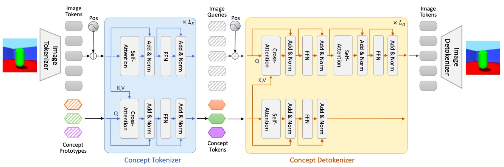
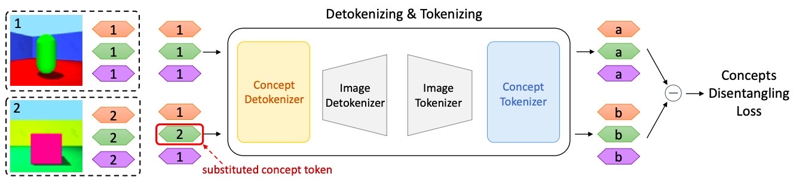
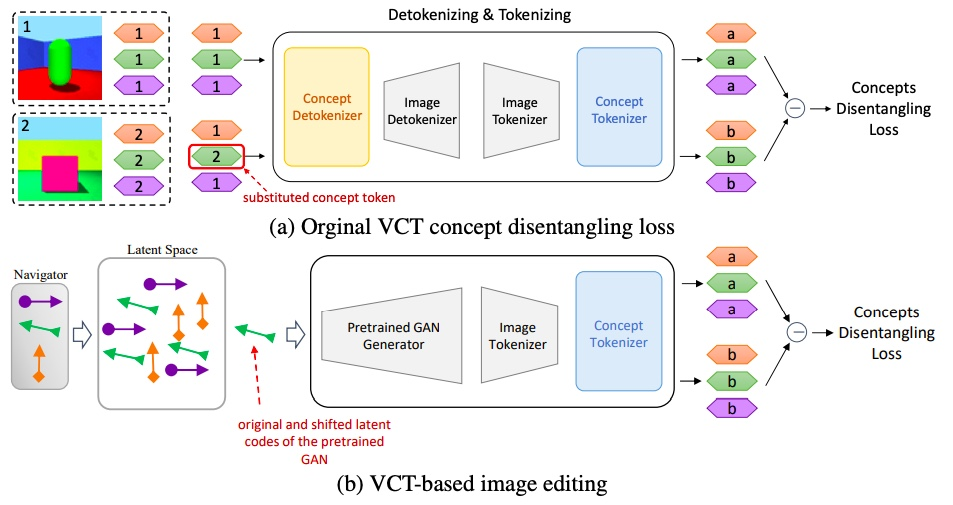
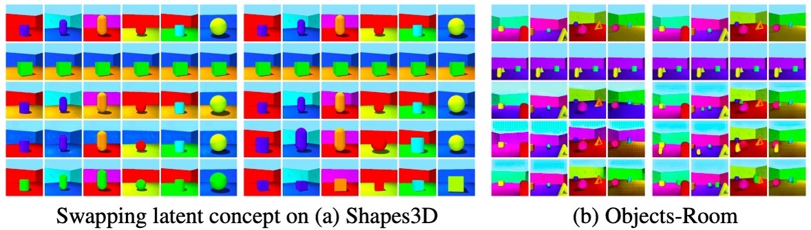
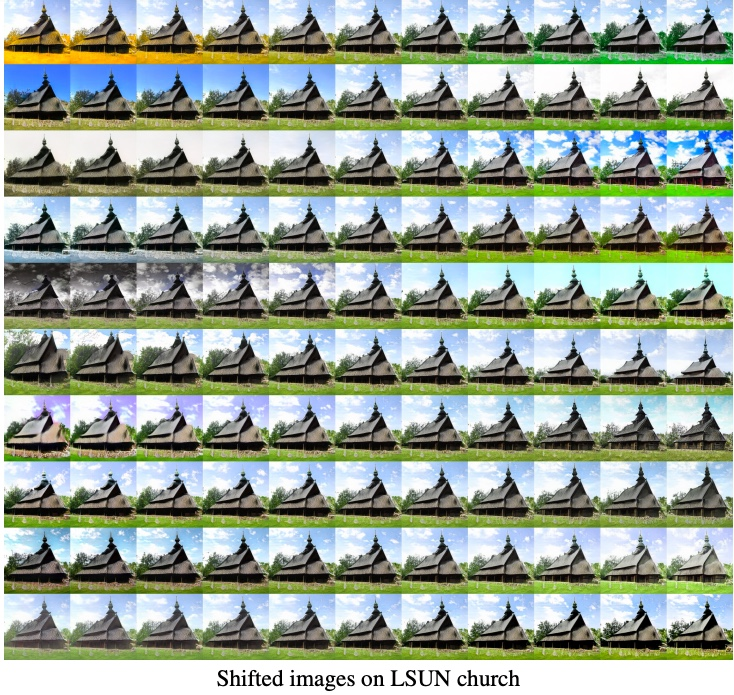

# Visual Concepts Tokenization

This is the official PyTorch implementation of NeurIPS 2022 paper: Visual Concepts Tokenization
[Arxiv](https://arxiv.org/abs/2205.10093) | [OpenReview](https://openreview.net/forum?id=rWgfLdqVVl_&referrer=%5BAuthor%20Console%5D(%2Fgroup%3Fid%3DNeurIPS.cc%2F2022%2FConference%2FAuthors%23your-submissions)).

Tao Yang, Yuwang Wang, Yan Lu, Nanning Zheng
<p align="center">
    
</p>
<p align="center">
    
</p>


## requirements
A suitable conda environment named vct can be created and activated with:
```bash
conda env create -f environment.yaml
conda activate vct
```
# Usage


```python
from models.visual_concept_tokenizor import VCT_Decoder, VCT_Encoder
import torch
vct_enc = VCT_Encoder(z_index_dim = 20)
vct_dec = VCT_Decoder(index_num = 256, z_index_dim=256, ce_loss=True)
vct_enc.cuda()
vct_dec.cuda()
x = torch.randn((32,256,256)).cuda()
z = vct_enc(x)
x_hat = vct_dec(z)
```
## Datasets
Download datasets for training VCT (Shapes3D as an example)

- [Download Shapes3D](https://console.cloud.google.com/storage/browser/3d-shapes)

Manully set the "get_args.data_dir = /my/datasets/path" in each gin-config, e.g., shapes3d_ce.gin. Or run the following script for setting dataset path.
```sh
python set_dataset_dir.py --datasets /path/to/your/datasets
```
Dataset path structure:

```
/path/to/your/datasets/
├──shapes3d/3dshapes.h5
├──mpi_toy/mpi3d_toy.npz
├──...
```


## VQVAE as Image Tokenizor


### Train VQVAE
`main_vqvae.py` script conducts the training of VQVAE, we take the pretrained VQVAE as the image tokenizor and detokenizor. A VQVAE can be trained with the following commend:

```sh
python train_vqvae.py --dataset {dataset} --model vqvae --data-dir /path/to/your/datasets/ --epochs 200
```

`dataset` can be {cars3d, shapes3d, mpi3d, clevr}. The training setting is the same with [VQ-VAE](https://github.com/nadavbh12/VQ-VAE). As an  example,

```sh
python train_vqvae.py --dataset shapes3d --model vqvae --data-dir /path/to/your/datasets/ --epochs 200
```

### Train VCT
`main_vct.py` is the main script to train VCT autoencoder with pretrained VQ-VAE. After the VQ-VAE is trained we set the checkpoint path of the pretrained model as follows: "get_args.data_dir = /my/checkpoint/path" in each gin-config, e.g., shapes3d_shared.gin.

```sh
python main_vct.py --config {dataset}_ce.gin
```

### For scene decomposition
If we train a VQ-VAE based VCT model for scene decomposition, the training command is following:
```sh
python train_vqvae.py --dataset clevr --model vqvae --data-dir /path/to/your/datasets/ --epochs 200

python main_vct.py --config clevr_ce.gin

```

`main_vct_mask.py` is the script to train VCT autoencoder with a mask based decoder (see discriptions in the main paper).

```sh
python main_vct_mask.py --config clevr_ce.gin
```

## CLIP as Image Tokenizor
`main_vct_clip.py` script conducts the training of VCT with CLIP image encoder as the Image Tokenizor.
```sh
python main_vct_clip.py --config shapes3d_ce.gin
```

## Pretrained GAN as Image Detokenizor
<p align="center">
    
</p>

We follow [DisCo](https://github.com/ThomasMrY/DisCo) to adopt different pretrained gan as the Image Detokenizor. Specifically, for the following datasets we use the following commands, respectively.

- For dataset Cat/Church
```sh
python main_gan_based.py --config {church/cat}_ce.gin
```
- For dataset FFHQ
```sh
python main_ffhq_gan_based.py --config ffhq_low_ce.gin
```
- For dataset ImageNet
```sh
python main_biggan_based.py --config imgnet_ce.gin
```


### Visualization Results
For VCT with VQVAE as Image Tokenizor
<p align="center">
    
</p>
For VCT with Pretrained GAN as Image Detokenizor
<p align="center">
    
</p>

# Acknowlegement

Note that this project is built upon [VQ-VAE](https://github.com/nadavbh12/VQ-VAE) and [DisCo](https://github.com/ThomasMrY/DisCo) and [Perceiver](https://github.com/lucidrains/perceiver-pytorch). The eveluation code is built upon [disentanglement_lib](https://github.com/google-research/disentanglement_lib).

# Citation

The paper is still under review.

```
@article{yang2022visual,
  title={Visual Concepts Tokenization},
  author={Yang, Tao and Wang, Yuwang and Lu, Yan and Zheng, Nanning},
  journal={NeurIPS},
  year={2022}
}
```
